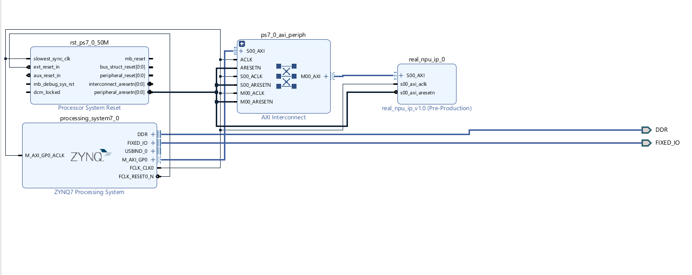
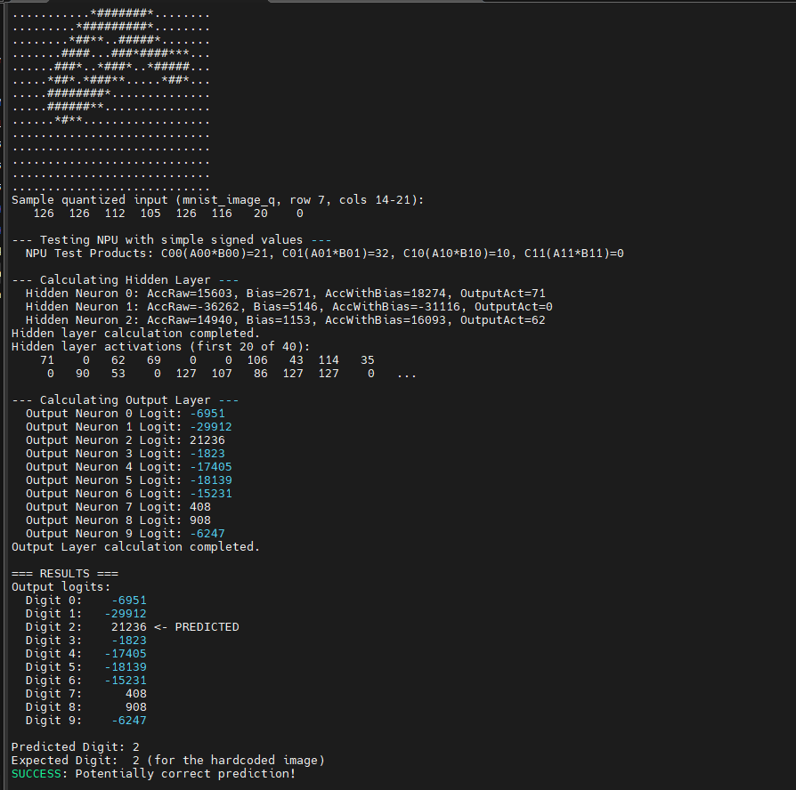
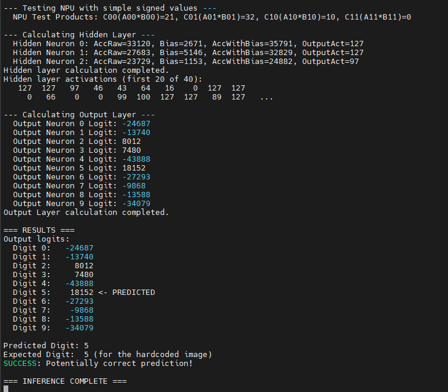
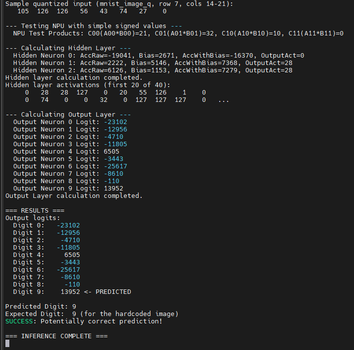

# MNIST Digit Recognition using a Custom NPU on Zynq FPGA

This project implements a Neural Processing Unit (NPU) as a custom IP on a Xilinx Zynq-7000 series FPGA for accelerating MNIST handwritten digit recognition. The NPU performs 2x2 Multiply-Accumulate (MAC) operations, a fundamental building block for neural network inference.

**Current Status:** The NPU has been successfully integrated and tested with a Multi-Layer Perceptron (MLP) model. It correctly predicts all MNIST digits as demonstrated in the results section.

## Table of Contents
1.  [Motivation](#motivation)
2.  [System Architecture](#system-architecture)
3.  [NPU IP Core](#npu-ip-core)
4.  [Workflow](#workflow)
    * [A. Model Training & Quantization (Python)](#a-model-training--quantization-python)
    * [B. Generating Sample MNIST Image Array (Python)](#b-generating-sample-mnist-image-array-python)
    * [C. Creating the Custom NPU IP (Vivado)](#c-creating-the-custom-npu-ip-vivado)
    * [D. Hardware Design & Bitstream Generation (Vivado)](#d-hardware-design--bitstream-generation-vivado)
    * [E. Software Application (Vitis)](#e-software-application-vitis)
    * [F. Python Inference Test for Debugging](#f-python-inference-test-for-debugging)
5.  [How to Run](#how-to-run)
    * [Prerequisites](#prerequisites)
    * [Python Scripts](#python-scripts)
    * [Vivado & Vitis](#vivado--vitis)
6.  [Results](#results)
7.  [Future Work](#future-work)
8.  [Repository Structure](#repository-structure)

## Motivation

Neural networks, especially Deep Neural Networks (DNNs), have shown remarkable performance in various tasks like image recognition. However, deploying these models on resource-constrained embedded systems or achieving real-time performance often requires hardware acceleration.

This project aims to:
* Explore the design and implementation of a custom NPU for accelerating common neural network operations.
* Understand the workflow of integrating custom hardware (FPGA logic) with a processing system (ARM cores on Zynq).
* Learn about model quantization and fixed-point arithmetic challenges in hardware.
* Provide a practical example of an end-to-end system for MNIST digit recognition using hardware acceleration.

## System Architecture

The system is implemented on a ZyboZ7010 FPGA board ( Xilinx Zynq-7000 series device), which combines a Processing System (PS) with ARM cores and Programmable Logic (PL).

* **ZYNQ7 Processing System (PS):** Runs the main C application, controls the NPU, and handles overall system management.
* **AXI Interconnect:** Facilitates communication between the PS (master) and the NPU IP (slave) using the AXI4-Lite protocol.
* **Processor System Reset:** Provides reset signals to the system.
* **`real_npu_ip_0` (Custom NPU):** This is the custom Verilog IP core responsible for accelerating the MAC operations. It's connected to the AXI Interconnect as an AXI4-Lite slave.

The PS configures the NPU with input data (image patches and weights) via AXI writes and triggers the computation. The NPU performs the calculations and stores the results in registers accessible by the PS via AXI reads.

## NPU IP Core (`real_npu_ip_v1_0_S00_AXI`)

The NPU is designed to perform a 2x2 element-wise multiplication of two input matrices (A and B, typically an image patch and a weight patch) and provides the four individual products. The C software then sums these products.

* **Interface:** AXI4-Lite slave.
* **Inputs (via AXI registers):**
    * `slv_reg0`: Control register (start, clear_done, ReLU enable).
    * `slv_reg2`: `A[0][0]` (8-bit signed), `A[0][1]` (8-bit signed).
    * `slv_reg3`: `A[1][0]` (8-bit signed), `A[1][1]` (8-bit signed).
    * `slv_reg4`: `B[0][0]` (8-bit signed), `B[0][1]` (8-bit signed).
    * `slv_reg5`: `B[1][0]` (8-bit signed), `B[1][1]` (8-bit signed).
* **Outputs (via AXI registers):**
    * `slv_reg1`: Status register (busy, done).
    * `slv_reg6`: Result of `A[0][0] * B[0][0]` (32-bit signed, sign-extended from 16/17-bit product).
    * `slv_reg7`: Result of `A[0][1] * B[0][1]`.
    * `slv_reg8`: Result of `A[1][0] * B[1][0]`.
    * `slv_reg9`: Result of `A[1][1] * B[1][1]`.
* **Functionality:**
    1.  CPU writes 2x2 image patch (A) and 2x2 weight patch (B) to input registers.
    2.  CPU writes to the control register to start the NPU.
    3.  NPU performs four `int8_t * int8_t` signed multiplications.
    4.  NPU stores the four 32-bit sign-extended products in output registers.
    5.  NPU sets a 'done' flag in the status register.
    6.  CPU polls the status register, reads the four products, and sums them.

## Workflow

The project involves several stages, from model training to hardware implementation and software execution.

### A. Model Training & Quantization (Python)

A Multi-Layer Perceptron (MLP) model is trained for MNIST digit classification using `scikit-learn` in Python.
* **Training:** The model (e.g., 784 input neurons -> 40 hidden neurons -> 10 output neurons) is trained on the MNIST dataset.
* **Quantization:**
    * Weights are quantized from 32-bit floating-point to 8-bit signed integers (`int8_t`) using symmetric quantization.
    * Biases are quantized to 32-bit signed integers (`int32_t`), scaled appropriately to match the accumulator's scale after MAC operations.
* **Export:** The quantized weights and biases, along with scaling factors (as comments), are exported into a C header file (`npu_weights.h`).

*(Refer to the Python script `export_weights_colab.py` . This script should be run in an environment like Google Colab or a local setup with necessary Python libraries installed.)*

### B. Generating Sample MNIST Image Array (Python)

To test the system with a known input, a Python script can be used to:
1.  Fetch the MNIST dataset.
2.  Select an image of a specific digit (e.g., '7', '2', '5', '9').
3.  Convert the 28x28 pixel image (0-255 `uint8_t` values) into a C-style 2D array declaration.

*(Refer to the Python script `generate_mnist_c_array_colab.py` .)*

### C. Creating the Custom NPU IP (Vivado)

The Verilog code for the NPU (`real_npu_ip_v1_0_S00_AXI.v`) is packaged as a custom AXI4-Lite IP core in Vivado:
1.  **Create RTL Project:** Start with a Verilog module for the NPU.
2.  **Tools -> Create and Package New IP:** Follow the Vivado wizard.
3.  **Specify AXI4-Lite Interface:** Define the AXI4-Lite slave interface, registers, and their addresses according to the NPU design.
4.  **Package IP:** Complete the packaging process. The IP will then be available in the IP Catalog.

### D. Hardware Design & Bitstream Generation (Vivado)

1.  **Create Block Design:** In a Vivado project targeting your Zynq board, create a new block design.
2.  **Add Zynq PS:** Add the ZYNQ7 Processing System block and configure it (DDR, peripherals, clocking).
3.  **Add Custom NPU IP:** Add your packaged `real_npu_ip` from the IP Catalog.
4.  **Add AXI Interconnect:** If not automatically inferred, add an AXI Interconnect to connect the Zynq PS's M_AXI_GP port to the NPU's S_AXI port.
5.  **Connect Clocks and Resets:** Ensure proper clocking and reset connections.
6.  **Validate Design & Create HDL Wrapper.**
7.  **Run Synthesis, Implementation, and Generate Bitstream.**
8.  **Export Hardware (XSA):** File -> Export -> Export Hardware (Include Bitstream).

### E. Software Application (Vitis)

A C application running on the ARM PS controls the NPU and performs the overall inference:
1.  **Create Application Project:** In Vitis, create a new application project based on the exported XSA file.
2.  **Include `npu_weights.h`:** Add the generated header file with weights and biases to your project's source files.
3.  **Implement Inference Logic:**
    * Initialize the platform and NPU.
    * Quantize the input MNIST image (e.g., from a C array) using the same method as the Python inference test.
    * **Hidden Layer:**
        * Iterate through each of the 40 hidden neurons.
        * For each neuron, iterate through the 28x28 input image in 2x2 patches.
        * For each patch, load the corresponding image patch and weight patch into the NPU's input registers via AXI writes.
        * Trigger the NPU.
        * Poll for completion and read the four product terms from the NPU's output registers.
        * Sum these four products in software.
        * Accumulate the sums for all patches for the current neuron.
        * Add the quantized bias for that neuron.
        * Apply ReLU activation and requantize the result to `int8_t` (involves a bit-shift based on scaling factors).
    * **Output Layer:**
        * Iterate through each of the 10 output neurons.
        * Perform a dot product between the `int8_t` hidden layer activations and the `int8_t` output layer weights for that neuron (this can be done in software).
        * Add the quantized bias for that output neuron. The result is the output logit.
    * **Prediction:** Find the index of the output neuron with the highest logit (argmax). This index is the predicted digit.

*(Refer to the C code in `npu.c` for the detailed implementation.)*

### F. Python Inference Test for Debugging

To verify the correctness of the quantized model and the fixed-point arithmetic logic before testing on hardware, a Python script (`python_inference_test.py`) is provided. This script:
1.  Parses `npu_weights.h` to load the exact same quantized weights and biases used by the C code.
2.  Takes a sample MNIST image.
3.  Performs input quantization identical to the C code.
4.  Simulates the hidden layer MAC operations (as a flattened dot product), bias addition, ReLU, and bit-shifting for requantization, all using Python's integer arithmetic to mimic C.
5.  Simulates the output layer MAC operations and bias addition.
6.  Performs argmax to predict the digit.
This script serves as a "golden reference" to compare against the Vitis C code's output at various stages, helping to isolate discrepancies.

## How to Run

### Prerequisites
* Xilinx Vivado (for hardware design and IP packaging, e.g., 2023.2)
* Xilinx Vitis Unified IDE (for software development, e.g., 2023.2)
* Python environment (e.g., via Anaconda or Google Colab) with:
    * `numpy`
    * `scikit-learn`
* A Zynq-7000 based development board.

### Python Scripts

1.  **Generate Weights (`npu_weights.h`):**
    * Open the Python script for training and weight export (e.g., `export_weights_colab.py`).
    * Run the script. It will train an MLP, quantize it, and generate `npu_weights.h` in a sub-directory (e.g., `npu_weights_c_header/`).
    * Note the scaling factors printed by the script, as they are crucial for understanding the quantization.

2.  **Generate Sample Image C Array (Optional):**
    * Open the Python script for image generation (e.g., `generate_mnist_c_array_colab.py`).
    * Set the `target_digit`.
    * Run the script. It will print a C-style `uint8_t mnist_image_u8[28][28]` array for the chosen digit. Copy this into your Vitis C code.

3.  **Run Python Inference Test:**
    * Ensure `npu_weights.h` is in the same directory as `python_inference_test.py`.
    * Run `python python_inference_test.py` from your terminal.
    * Observe the predicted digit and intermediate values if you add print statements.

### Vivado & Vitis

1.  **Create NPU IP:** Follow the steps in [Workflow C](#c-creating-the-custom-npu-ip-vivado) using the provided Verilog code for the NPU.
2.  **Create Hardware Design:** Follow [Workflow D](#d-hardware-design--bitstream-generation-vivado) to build the Zynq system with your NPU. Generate the bitstream and export the XSA file.
3.  **Create Vitis Application:**
    * Create a new Application Component in Vitis Unified IDE, targeting your Zynq board and using the exported XSA.
    * Create a C source file (e.g. `main.c`).
    * Copy the content from the provided Vitis C code (`npu.c`) into your source file.
    * Add the `npu_weights.h` (generated by Python) to your application's source directory.
    * **Link Math Library (if `custom_roundf` is not used):** If you were to use `roundf` from `<math.h>`, ensure you add the math library (`-lm`) to your linker settings in Vitis (Project -> C/C++ Build Settings -> Tool Settings -> Linker -> Libraries -> Add "m"). Since a custom round function is provided, this might not be necessary if no other math functions are used.
4.  **Build and Run:**
    * Build the application component.
    * Create a System Project if you haven't already, add your application and the platform.
    * Build the System Project.
    * Connect your Zynq board.
    * Run the application on the hardware (Right-click application -> Run As -> Launch on Hardware).
    * Observe the output on the serial terminal (e.g., UART console in Vitis).

## Results

The system has been tested with several custom MNIST digit images. The following images show the Vitis application output, including the ASCII art representation of the quantized input and the final prediction.

**Prediction for Digit '2':**

*Status: SUCCESS (Potentially correct prediction)*

**Prediction for Digit '5':**

*Status: SUCCESS (Potentially correct prediction)*

**Prediction for Digit '9':**

*Status: SUCCESS (Potentially correct prediction)*

## Future Work
* Implement a more sophisticated quantization strategy (e.g., per-tensor or per-channel quantization, asymmetric quantization if beneficial).
* Explore Quantization Aware Training (QAT) for potentially better accuracy with quantized weights.
* Optimize the NPU design for higher throughput (e.g., pipelining, parallel MAC units).
* Extend the NPU to support other layer types (e.g., convolutional layers).
* Integrate DMA for more efficient data transfer between PS and NPU.
